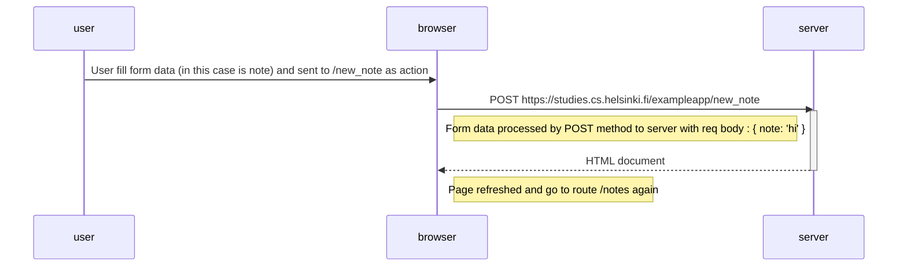

```mermaid
sequenceDiagram
    participant user
    participant browser
    participant server

    user->>browser: User fill form data (in this case is note) and sent to /new_note as action
    browser->>server: POST https://studies.cs.helsinki.fi/exampleapp/new_note
    activate server
    note right of browser: Form data processed by POST method to server with req body : { note: 'hi' }
    server-->>browser: HTML document
    deactivate server
    note right of browser: Page refreshed and go to route /notes again
```
