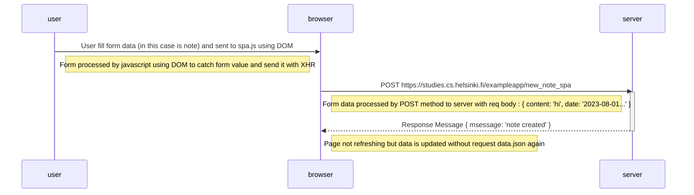

```mermaid
sequenceDiagram
    participant user
    participant browser
    participant server

    user->>browser: User fill form data (in this case is note) and sent to spa.js using DOM
    note left of browser: Form processed by javascript using DOM to catch form value and send it with XHR
    browser->>server: POST https://studies.cs.helsinki.fi/exampleapp/new_note_spa
    activate server
    note right of browser: Form data processed by POST method to server with req body : { content: 'hi', date: '2023-08-01...' }
    server-->>browser: Response Message { msessage: 'note created' }
    deactivate server
    note right of browser: Page not refreshing but data is updated without request data.json again
```
